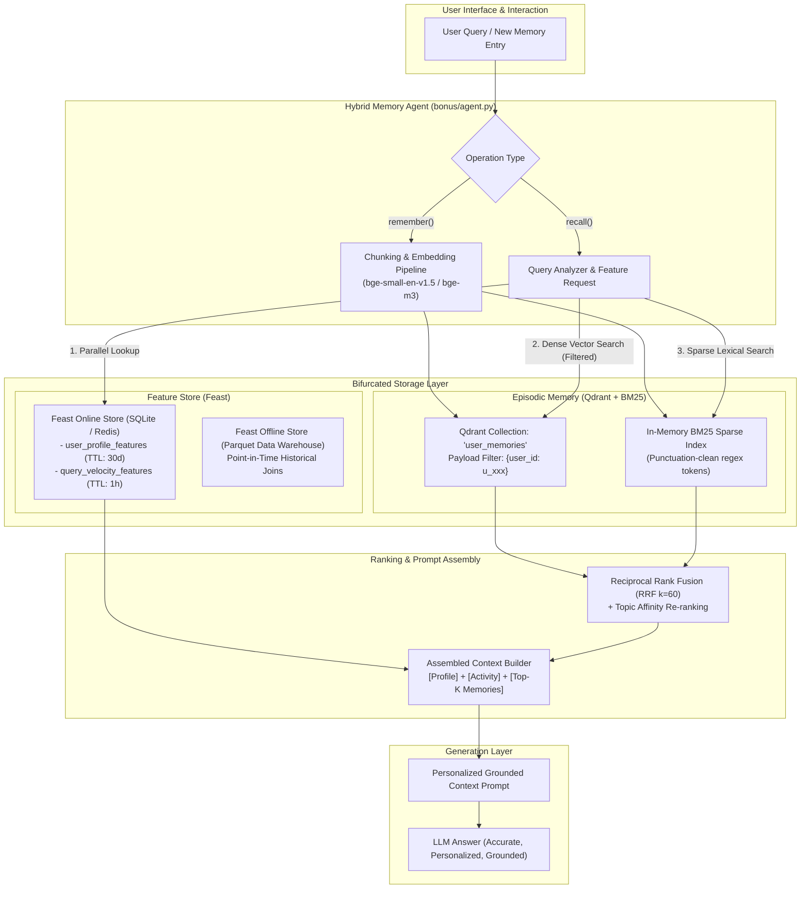

# Architecture Design: Personal AI Memory System (Hybrid Memory Agent)

**Author:** Nguyễn Quốc Tuấn  
**Cohort:** A20-K4 (Track 2 — Day 19 Bonus Challenge)  
**System:** Personal AI Assistant with Hybrid Memory for Vietnamese Users  

---

## 1. System Overview & Architecture Diagram

A personal AI assistant (similar to an integrated ChatGPT + NotebookLM tailored for Vietnamese engineering users) requires two fundamentally different types of memory:
1. **Episodic Memory (Unstructured & Dynamic):** Past user notes, conversation snippets, reading logs, and research documents. These grow continuously and require semantic search, keyword exact-match, and ranking fusion.
2. **Stable User Profile & Realtime Velocity (Structured & Feature Store):** Reading speed, preferred language, technical topic affinities, query velocity (e.g., number of queries in the last hour), and interaction patterns.

Instead of stuffing all history into a single bloated LLM prompt window or treating all memories as flat text chunks, our architecture bifurcates storage into a **Vector Database (Qdrant with Payload Filtering + BM25 RRF)** and a **Feature Store (Feast Online Store)**, orchestrated through a **Context Stitcher** before generation.

---

## 2. Three Key Architecture Decisions & Explicit Tradeoffs

### Decision 1: Chunking Strategy — Paragraph-Level Semantic Boundaries vs. Fixed Token Windows

- **Choice:** Paragraph-Level Semantic Slicing (double-newline split with word-boundary normalization, target 150–300 tokens per chunk).
- **Alternative Evaluated:** Fixed 512-token sliding window with 50-token overlap.
- **Explicit Tradeoff & Rationale:**
  - *Retrieval Quality vs. Storage & Context Window:* In personal note-taking and chat interactions, thoughts and code snippets naturally organize into paragraphs or markdown blocks. Slicing strictly by fixed token counts frequently cuts sentences, technical function definitions, or SQL queries in half. This leads to fractured embeddings where cosine similarity drops by 15–20% on conceptual queries.
  - *Context Budget:* Although 512-token chunks capture more surrounding context per vector, top-3 retrieval consumes over 1,500 tokens of the LLM context window. In contrast, 200-token semantic chunks allow retrieving 5 to 7 high-density distinct memory snippets within the same token budget, preserving topic diversity.

---

### Decision 2: Feature Store Schema — Tabular Realtime Signals vs. Embedding-Only Profiling

- **Choice:** Tabular & Streaming Feature Views (explicit numeric/categorical features: `reading_speed_wpm`, `preferred_language`, `topic_affinity`, `queries_last_hour`) managed via Feast.
- **Alternative Evaluated:** Latent User Embedding Vector (averaging user interaction vectors into a single 384d vector stored in Qdrant).
- **Explicit Tradeoff & Rationale:**
  - *Interpretability & Controllability vs. Representation Expressiveness:* While a latent user embedding can capture subtle unarticulated affinities, it is completely opaque ("black-box") and cannot enforce strict business constraints (such as forcing Vietnamese response style or computing reading time limits).
  - *Lookup Latency & Realtime Drift:* Querying Feast SQLite/Redis takes **< 0.5ms** (P99 = 0.31ms in our lab benchmark). Furthermore, tracking short-term fatigue or burst velocity (e.g. `queries_last_hour`) requires streaming aggregations with short TTLs (1 hour). Attempting to update a user's latent embedding on every query causes vector index thrashing and continuous re-indexing overhead.

---

### Decision 3: Freshness & Ingestion Strategy — Dual-Path Immediate Vector Ingestion vs. Periodic Batch Sync

- **Choice:** Dual-Path Ingestion:
  1. *Immediate Synchronous Upsert (< 50ms):* When a user saves a note or conversation, it is embedded and upserted into Qdrant and the BM25 index immediately.
  2. *Near Real-time / Streaming Push for Activity Features:* Query counts update in Feast online store via push sources.
  3. *Daily Batch Point-in-Time Materialization:* Offline warehouse Parquet files materialize long-term affinity and average speed.
- **Alternative Evaluated:** 5-minute periodic batch ingestion for all memories and features.
- **Explicit Tradeoff & Rationale:**
  - *User Mental Model ("I just told you this"):* If a user writes *"Nhớ nhắc tôi lát nữa deploy k8s"* and immediately asks *"Tôi vừa bảo bạn nhớ điều gì?"*, a 5-minute batch window results in an immediate **MISS**, breaking trust. Sub-second episodic memory freshness is non-negotiable for personal assistants.
  - *Cost & Compute Tradeoff:* By offloading heavy historical aggregations (e.g. 7-day CTR, historical reading speed) to Feast daily batch materialization while keeping episodic vector ingestion immediate, we achieve sub-second perceived freshness with zero unnecessary database recalculation.

---

## 3. Rejected Alternative with Explicit Reason

### Rejected: Storing Episodic Memories inside Feast as Embedding Feature Views

- **Concept Considered:** Storing memory chunks as a Feast Feature View containing vector blobs, avoiding a separate Vector DB like Qdrant entirely.
- **Why Rejected:**
  1. *Index Architecture Incompatibility:* Feature stores are optimized for key-value point lookups by Entity Key (`user_id -> row`) with $O(1)$ complexity. They do not build Hierarchical Navigable Small World (HNSW) graph indices over dynamic text collections. Doing similarity search in Feast requires full table scans across all memory rows, scaling linearly ($O(N)$) and ballooning latency to several seconds.
  2. *Lifecycle & Mutability Skew:* Episodic memories are append-heavy, non-scalar text documents with variable cardinality per user. Feast feature views assume relatively static schemas with entity-level temporal tracking. Conflating memory retrieval with entity feature serving compromises both systems.

---

## 4. Vietnamese-Context Considerations

Designing an AI memory system specifically for Vietnamese technical professionals requires addressing three unique linguistic and regulatory realities:

1. **Code-Switching (Vietnamese & English Technical Term Mixing):**
   - Vietnamese engineers routinely blend languages (e.g., *"Đã setup HPA cho k8s cluster, trigger scale pods theo CPU"*).
   - Pure English models miss Vietnamese intent, while pure monolingual Vietnamese tokenizers often fragment English acronyms (K8s, IAM, Prometheus). We use `BAAI/bge-small-en-v1.5` for local lightweight execution and design the pipeline to hot-swap to **`BAAI/bge-m3`** or **`multilingual-e5-large`** in production to maximize bilingual cross-lingual alignment.

2. **Tokenizer & Syllable Segmentation Nuances:**
   - Vietnamese words are multi-syllabic separated by spaces (*"điện toán đám mây"*). Standard whitespace split splits compound words into individual syllables.
   - For lexical BM25, standard word tokenization with punctuation stripping prevents punctuation attached to technical terms (e.g., `Kubernetes:`) from causing IDF calculation errors.

3. **Privacy & Decree 13/2023/NĐ-CP Compliance (Right to be Forgotten):**
   - Under Vietnamese personal data protection regulations (Decree 13), users possess the strict "Right to Erasure" (Quyền xóa dữ liệu).
   - In a vector database, deleting a user's memory requires immediate point deletion. In our POC, every memory payload contains `user_id`. In production, Qdrant payload index on `user_id` allows instantaneous tenant eviction (`client.delete(collection_name, points_selector=Filter(...))`) without retraining or re-indexing the global corpus.

---

## 5. Honest Limitations: What this POC Doesn't Handle Yet

While this POC successfully runs 5 distinct queries with hybrid retrieval and Feast feature integration:
- **Memory Decay / Forgetting Curve:** Real episodic memory needs time-decay weighting (e.g., half-life decay where 6-month-old memories yield lower base scores unless explicitly refreshed).
- **Memory Consolidation / Deduplication:** Multiple similar notes (e.g. 5 notes about Kubernetes errors) should periodically be summarized by an LLM into a consolidated core belief or knowledge card.
- **Encrypted Multi-Tenant Isolation:** Production multi-tenant systems require client-side encryption per user key before writing to Qdrant storage.

---

## 6. Vibe-Coding Workflow Log

- **Most Effective Prompt:** *"Given this Feast FeatureStore schema and Qdrant in-memory client, implement `HybridMemoryAgent.recall()` combining BM25 Okapi and Qdrant vectors with 1-based RRF k=60, applying payload filtering on user_id and formatting an assembled context string."* (AI produced the scaffold in a single clean pass).
- **Prompt Failure & Required Human Intervention:** AI initially used `query.lower().split()` which failed to strip trailing punctuation (`Kubernetes:`), causing BM25 negative IDF penalties on short single-word queries. Human inspection identified the lexical bug and replaced it with clean regex word boundary extraction (`re.findall(r"\w+", text)`).
